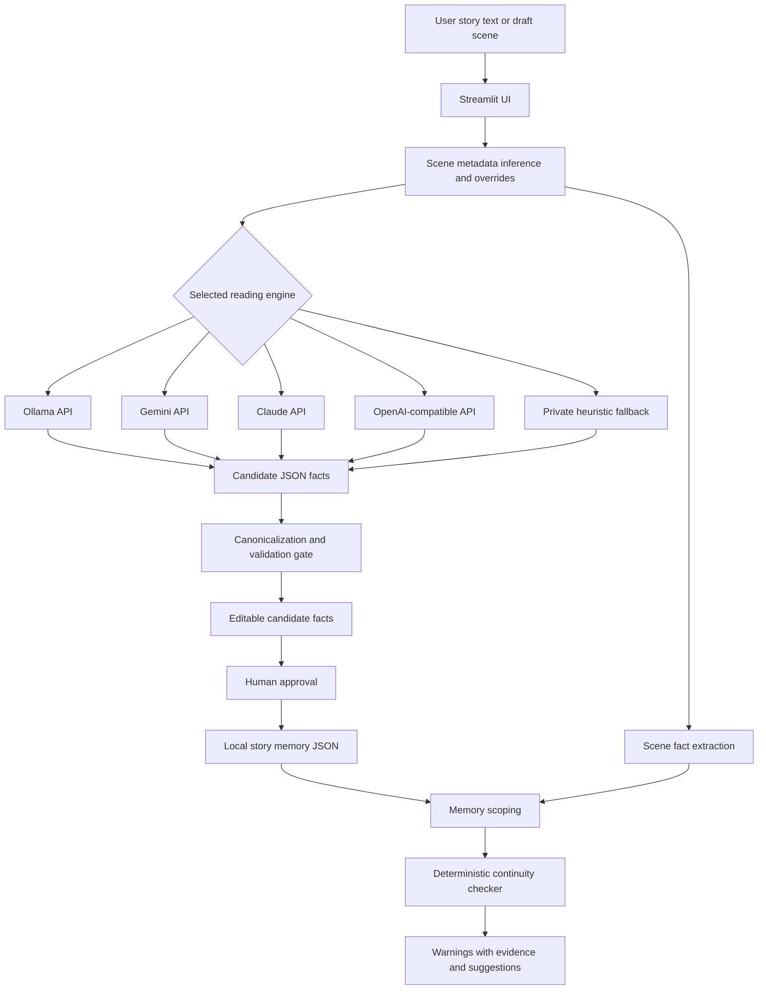

# LoreLock: Story Continuity AI Agent

Student: [Your Name]  
Course: ANLYTC4  
Project Type: Individual AI Agent / Agentic AI System  
Prototype Link: https://github.com/<your-username>/story-continuity-demo  

## 1. Introduction

LoreLock is a lightweight AI agent for fiction writers, editors, and story developers who need help maintaining continuity across scenes, chapters, outlines, character sheets, and lore notes. Long-form stories often contain changing relationships, secrets, world rules, character statuses, objects, locations, and nonlinear timelines. A writer may remember the main plot while still missing small contradictions such as a character knowing a secret too early, an object appearing after it was destroyed, or a location name drifting between drafts.

The project implements a working Streamlit prototype that accepts story text from the user, extracts structured continuity facts, asks the user to approve facts that should become memory, and then checks new draft scenes against that approved memory. The system is not designed to replace a writer or editor. Its purpose is to act as a continuity assistant: it points out possible risks, explains why they were flagged, and leaves the final judgment to the human author.

LoreLock demonstrates an agentic workflow because it does more than produce one chat response. After receiving a text excerpt, the agent can infer scene metadata, call an AI provider or local fallback extractor, normalize the model output into canonical fact objects, retain approved memory across interactions, scope relevant memory for a new scene, apply deterministic continuity rules, and produce warnings with evidence and suggested next actions. This gives the user a semi-autonomous assistant that performs multiple steps toward the goal of protecting story consistency.

The current prototype supports optional external LLM providers through Ollama API, Gemini API, Claude API, and OpenAI-compatible API settings. It also includes a private heuristic fallback for situations where the selected model is unavailable. The continuity checker itself is deterministic and explainable, which reduces the risk of letting an LLM invent final judgments.

## 2. Problem Statement

The pain point addressed by LoreLock is continuity management in fiction writing. Writers often draft scenes out of order, revise character relationships, add secrets, rename locations, and change world rules while the story is still evolving. These changes create a growing memory burden. A small contradiction can survive several rounds of revision because it is hard to compare every new scene against all previous notes.

The target users are:

- Fiction writers working on novels, serialized stories, scripts, or game narratives.
- Editors and beta readers who need a quick way to check draft scenes.
- Writing students who want to analyze continuity in sample text.
- Story teams that need a lightweight memory aid before investing in a full production database.

The agent's objective is to help users identify possible continuity conflicts before publication or presentation. It focuses on facts that can be made structured and checkable, including relationships, knowledge/reveals, status changes, possessions, locations, events, world rules, traits, abilities, and timeline markers.

The task scope is intentionally limited. LoreLock does not attempt to judge literary quality, rewrite scenes automatically, or decide whether a contradiction is acceptable. Some contradictions are intentional, such as unreliable narration, flashbacks, aliases, or planned twists. The agent therefore produces warnings rather than final corrections. The user approves memory facts and decides whether each warning is a real error.

The main success criteria are:

- The prototype accepts story text and scene text from the user.
- It extracts candidate continuity facts from the text.
- It stores approved facts as local story memory.
- It compares a new scene against approved memory and same-scene facts.
- It returns explainable continuity warnings with evidence and suggested next actions.
- It handles provider/API failures without silently trusting bad output.

## 3. Agent Design

LoreLock follows the basic agent model of input, reasoning, action, and output. Its design separates LLM-based extraction from rule-based judgment.

### Goal and Perception

The agent receives user-provided writing material. The input may be a chapter excerpt, outline, character sheet, lore note, or draft scene. The Streamlit interface also accepts scene metadata such as chapter number, story order, scene time, location, and point-of-view character. If the user leaves metadata blank, LoreLock tries to infer what it can from the text.

The perception stage identifies information that may matter for continuity. This includes named characters, relationships, objects, locations, world rules, and knowledge events. The extraction provider is configurable. If a model is available, the system prompts it to return JSON with atomic facts. If the provider fails and fallback is enabled, the local heuristic extractor uses Python rules and regular expressions to recover lower-confidence facts.

### Reasoning and Processing

The reasoning stage has two layers:

1. AI-assisted fact extraction. The selected provider reads the text and proposes structured facts. The prompt asks for grounded JSON, not free-form commentary.
2. Deterministic continuity checking. LoreLock scopes approved memory to entities and rules relevant to the current scene, then applies Python decision rules to detect possible conflicts.

This design avoids making the LLM the final authority. Provider output is passed through normalization and validation before it can become memory. Facts must be atomic, grounded in evidence, and shaped into controlled fields. Unsupported, vague, or uncheckable claims are filtered out.

### Action and Output

The agent performs several actions after the user submits text:

- Infers or merges scene metadata.
- Extracts candidate facts.
- Adds line and evidence references.
- Audits whether relevant spans were missed.
- Lets the user approve, reject, or edit facts.
- Stores approved memory locally.
- Checks a new scene against approved memory.
- Displays warnings with severity, evidence, line references, and suggested next steps.

The agentic capabilities demonstrated are:

- Goal-oriented task completion: the agent works toward finding continuity risks.
- Multi-step workflow: one review action triggers metadata handling, extraction, normalization, memory scoping, checking, and reporting.
- Tool/API use: the agent can call Ollama, Gemini, Claude, or OpenAI-compatible endpoints through Python HTTP requests.
- Memory retention: approved facts persist in Streamlit session state and local JSON project files.
- Decision-making rules: deterministic conflict checks decide which facts become warnings.
- Limited autonomy: after user submission, the agent performs several internal steps without requiring approval between each step, while still requiring human approval before facts become canon.

### Q&A Note: Hallucinations and API Errors

If an external API returns an error or a model produces unreliable output, LoreLock does not blindly accept it. Provider responses are parsed as JSON and normalized into canonical fact objects. Unsupported claims and uncheckable prose are rejected by the canonicalization gate. The final continuity warnings are generated by deterministic Python rules, not by free-form LLM judgment. When a provider fails, the UI can show a provider debug dump and, if enabled, use a private heuristic fallback so the system still returns low-confidence local results instead of silently failing.

## 4. System Architecture

The prototype is built as a Streamlit application with Python modules for UI, provider calls, extraction, normalization, memory handling, and continuity checking. The architecture is intentionally lightweight so it can be run locally for a class demonstration.



The main project files are:

- `app.py`: application entry point that calls `src.ui.main`.
- `src/ui.py`: Streamlit interface, project folder handling, memory editing, provider controls, and review workflow.
- `src/providers.py`: provider settings, model list fetching, HTTP requests, JSON parsing, and provider debug reporting.
- `src/extraction.py`: scene metadata inference, LLM extraction orchestration, chunking, heuristic extraction, line references, and coverage recovery.
- `src/facts.py`: fact creation, canonicalization, relationship expansion, validation, and deduplication.
- `src/continuity.py`: deterministic continuity checks for relationships, statuses, possessions, knowledge timing, lifecycle risks, world rules, identity drift, and setting drift.
- `components/live_textarea/`: local Streamlit component for live character counting.
- `docs/erd.md`: conceptual data model for a fuller continuity memory system.
- `tests/`: automated tests for extraction, normalization, provider settings, model fetching, relationship logic, and scene review.

Data is currently stored in local JSON rather than a database. The app loads and saves `lorelock_memory.json` and `provider_settings.json` in the selected project folder. This makes the prototype easy to demo and keeps story memory under the user's control. The ERD document describes how the prototype could later move to SQLite with entities, facts, evidence spans, relationship states, knowledge states, extraction runs, and continuity issues.

## 5. Implementation

The implementation uses Python and Streamlit. The only listed runtime dependency in `requirements.txt` is `streamlit>=1.35`. Provider calls use Python standard-library HTTP utilities in `urllib.request`, so the prototype does not require a heavy agent framework. This is a deliberate design choice: the project demonstrates the agent loop directly instead of hiding it behind LangChain or another orchestration library.

When the user opens the app, the sidebar lets them choose a project folder, select a reading engine, configure model endpoints or API keys, choose extraction depth, and enable or disable fallback behavior. Extraction depth changes the suggested excerpt size and maximum fact count:

- Quick: about 1,500 characters for a short scene slice.
- Standard: about 4,000 characters for a normal scene or chapter excerpt.
- Deep: about 8,000 characters for broader context.

The scene review workflow has two main uses. First, the user can paste existing story material and extract candidate memory. The extracted facts appear in an editable table, and the user decides which facts to add to story memory. Second, the user can paste a new draft scene and check it against approved memory. LoreLock extracts facts from the new scene, scopes relevant memory, and displays continuity notes.

The extraction prompt is schema-focused. It instructs the model to return JSON with a top-level `facts` key. Each fact includes fields such as type, subject, predicate, object, value, relationship type, known_by, evidence, and confidence. The prompt asks the model to avoid invented facts and to keep each fact atomic and grounded in the supplied text.

After extraction, normalization protects the memory layer. Relationship facts are expanded when one sentence contains multiple roles. For example, if a character is both someone's lover and boss, the system stores those as distinct relationship roles. This prevents one relationship edge from becoming vague. At the same time, the conflict checker can still warn when roles in the same dimension conflict, such as wife versus girlfriend or friend versus enemy.

The continuity checker produces several categories of warning:

- Relationship conflict: a relationship role conflicts with approved memory.
- Fact conflict: a status, trait, ability, or similar fact differs from memory.
- Possession conflict: a character appears to have and lack the same item.
- Possible knowledge leak: a character knows information before the approved reveal point.
- Lifecycle risk: a dead, destroyed, missing, sealed, or exiled subject appears active later.
- World rule risk: a scene touches a topic governed by a restrictive world rule.
- Possible identity drift: a character appears with a changed family/name marker.
- Possible setting drift: a named place appears to shift unexpectedly.
- Same-scene conflicts: contradictions inside the submitted text, even when memory is empty.

The prototype includes sample fantasy academy text and an intentionally continuity-violating continuation. This provides a ready demonstration: ingest the source text, approve useful memory facts, then check the contradiction file. Expected warnings include setting drift from Veyrfall Academy to Sunspire Academy, identity drift for characters whose names or roles change, world-rule risks, relationship/status inconsistencies, and same-scene contradictions.

## 6. Testing and Evaluation

The project includes an automated pytest suite. The most recent verification run completed successfully:

```text
33 passed in 0.81s
```

The tests cover the agent workflow, provider settings, model-name parsing, extraction fallback, canonicalization, relationship logic, and continuity warning behavior. The table below summarizes representative scenarios.

| Test Scenario | Expected Result | Actual Result |
| --- | --- | --- |
| Scene review calls metadata inference, extraction, and continuity checking | The workflow merges metadata, extracts facts, and checks against memory | Passed |
| Scene review works when memory is empty | The agent still checks same-scene contradictions | Passed |
| Compound relationship roles such as lover and boss | Roles are split into separate relationship facts | Passed |
| Different relationship dimensions | Lover and boss do not conflict because they are different dimensions | Passed |
| Conflicting romantic relationship status | Wife versus girlfriend produces a relationship warning | Passed |
| Same first name with different surname | The checker warns about possible identity drift | Passed |
| Different named academy in scene and memory | The checker warns about possible setting drift | Passed |
| Different possessions for the same character | Different items do not create a false possession conflict | Passed |
| Provider settings with blank saved URLs | Defaults are restored instead of leaving invalid endpoints | Passed |
| Coverage backfill for missed relevant lines | Low-confidence fallback facts or notes are added when extraction misses relevant spans | Passed |

Evaluation shows that LoreLock is strongest when the relevant facts are explicit in the text. It performs well on structured contradictions involving names, relationship terms, statuses, possessions, knowledge timing, and world-rule keywords. It is also useful because warnings include evidence and suggestions instead of simply declaring that a scene is wrong.

The main limitation is extraction quality. If the selected LLM misses an important fact or if the heuristic fallback cannot parse a complex sentence, the continuity checker may not have enough structured data to flag the issue. The system reduces this risk with coverage auditing, optional missed-line retry, fallback extraction, and user approval/editing, but it cannot guarantee perfect recall. Another limitation is that the current memory store is local JSON rather than a full database. This is acceptable for the prototype but would need to be expanded for very large writing projects.

## 7. Responsible AI Reflection

LoreLock has several responsible AI risks because it processes creative writing drafts, possibly including unpublished stories, private notes, or sensitive personal themes. The first risk is privacy. If a user selects Gemini, Claude, OpenAI, or another external API endpoint, the selected story text is sent to that provider. The app makes this visible in the provider settings and includes a privacy tab explaining text routing. Users who need stronger privacy can use a local Ollama endpoint or the private heuristic fallback. Project memory, provider settings, and API keys are also kept out of git through ignored local files.

The second risk is hallucination or misinformation. LLMs can invent facts, merge characters, or overinterpret vague prose. LoreLock reduces this risk by treating LLM output as candidate memory rather than truth. Facts must pass a canonicalization gate, be grounded in evidence, and then be approved by the writer before they become canon. The final warning logic is deterministic, so the model does not independently decide that a scene is wrong. This makes the system more transparent than a general chatbot response.

The third risk is overreliance. Writers may treat every warning as a mistake even when contradictions are intentional. Fiction often uses flashbacks, aliases, unreliable narration, secrets, reincarnation, mistaken identity, and deliberate rule-breaking. For this reason, LoreLock labels issues as risks or possible conflicts and gives suggested next actions instead of rewriting the scene automatically. The user remains responsible for deciding whether a warning matters.

Bias is also possible. The extraction model may pay more attention to familiar Western naming patterns, common relationship labels, or explicit declarative sentences. It may miss culturally specific names, indirect reveals, nonstandard grammar, translated prose, or subtle emotional facts. The heuristic fallback has even stronger limitations because it relies on regular expressions and controlled word lists.

Safe use means keeping the human in control. Users should review candidate facts, edit incorrect fields, avoid sending sensitive drafts to external APIs unless they accept that provider's data handling, and treat warnings as prompts for review rather than final judgments. LoreLock is best used as an assistant that improves attention, not as an authority over the story.

## 8. Conclusion

LoreLock satisfies the final project goal by implementing an AI agent that perceives user-provided story text, reasons through an extraction and checking workflow, retains approved memory, uses decision rules, and produces intelligent continuity warnings. The system demonstrates practical agentic behavior through multi-step processing, optional external API/tool use, local memory retention, deterministic decision logic, and fallback handling.

The project is relevant because continuity problems are common in long-form writing and difficult to catch manually. The prototype provides a concrete solution that can be demonstrated through a local Streamlit interface. It is also designed responsibly: AI output is not automatically trusted, memory approval stays with the user, provider routing is visible, and warnings include evidence.

Future work would include moving from JSON memory to SQLite, adding a richer relationship graph view, supporting batch chapter ingestion, improving alias handling, adding vector search for large projects, and adding optional LLM-generated explanations after deterministic checks. Even in its current form, LoreLock shows how an AI agent can support a creative workflow while preserving human editorial control.
