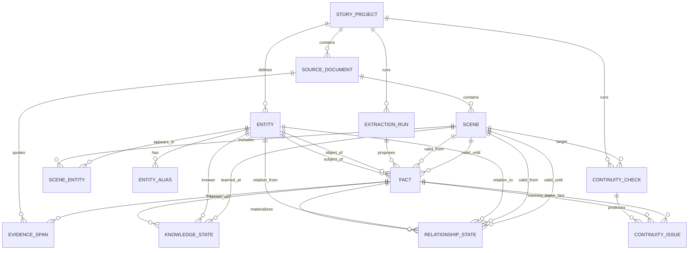

# LoreLock ERD

## Design Goal

LoreLock should not store a story as one giant prompt. It should store a story as a graph of approved continuity facts with evidence, timeline scope, and character knowledge.

The central design choice is:

> A fact can be true in the world, but only known by certain characters at certain points in story time.

That separation is what makes the agent useful for nonlinear stories, secrets, flashbacks, reveals, and relationship changes.

## Conceptual ERD



## Tables

### `story_project`

Represents one writing project.

| Field | Purpose |
| --- | --- |
| `id` | Primary key |
| `title` | Project title |
| `description` | Optional notes |
| `created_at` | Created timestamp |

Why it matters: the prototype is generic, so every fact and document should belong to a project, not to a hardcoded story.

### `source_document`

Represents imported material: a chapter, outline, character sheet, lore note, or pasted draft.

| Field | Purpose |
| --- | --- |
| `id` | Primary key |
| `project_id` | Parent project |
| `title` | Human label |
| `document_type` | `chapter`, `outline`, `character_sheet`, `lore_note`, `draft`, etc. |
| `path` | Optional local file path |
| `text_hash` | Detects changed imports without storing duplicate text |
| `narrative_index` | Reader-facing order |
| `imported_at` | Import timestamp |

Why it matters: a story can have source chapters, translated chapters, outlines, and scratch notes. They should not be mixed together without provenance.

### `scene`

Represents a scene, beat, flashback, or manually selected text chunk.

| Field | Purpose |
| --- | --- |
| `id` | Primary key |
| `project_id` | Parent project |
| `document_id` | Source document |
| `label` | Scene label |
| `narrative_order` | Where the reader sees it |
| `story_order_start` | Where it happens in-world |
| `story_order_end` | End position in-world |
| `scene_time_text` | Human-readable time, such as "three years later" |
| `location_entity_id` | Optional location entity |
| `pov_entity_id` | Optional POV character |
| `summary` | Short scene summary |

Why it matters: this handles nonlinear structure. Chapter 12 can contain a scene that happened before Chapter 2.

### `entity`

Represents any continuity-relevant thing.

| Field | Purpose |
| --- | --- |
| `id` | Primary key |
| `project_id` | Parent project |
| `canonical_name` | Main name |
| `entity_type` | `character`, `location`, `object`, `organization`, `concept`, `world_rule`, etc. |
| `description` | Optional notes |

Why it matters: characters are not special. Objects, places, organizations, systems, curses, and rules also create continuity problems.

### `entity_alias`

Stores nicknames, translated names, titles, maiden names, codenames, and spelling variants.

| Field | Purpose |
| --- | --- |
| `id` | Primary key |
| `entity_id` | Parent entity |
| `alias` | Alternate name |
| `language` | Optional language/source context |
| `active_from_scene_id` | Optional start of alias use |
| `active_until_scene_id` | Optional end of alias use |

Why it matters: fiction constantly uses aliases. Without this table, every nickname looks like a new character.

### `scene_entity`

Join table for who or what appears in a scene.

| Field | Purpose |
| --- | --- |
| `scene_id` | Scene |
| `entity_id` | Entity |
| `role` | `present`, `mentioned`, `pov`, `speaker`, `offscreen`, etc. |
| `confidence` | Extraction confidence |

Why it matters: this keeps checks scoped. A scene with three characters should not compare against every relationship in the novel.

### `fact`

The atomic memory unit.

| Field | Purpose |
| --- | --- |
| `id` | Primary key |
| `project_id` | Parent project |
| `fact_type` | `relationship`, `knowledge`, `status`, `possession`, `world_rule`, `trait`, etc. |
| `subject_entity_id` | Main entity |
| `predicate` | Short relation/action |
| `object_entity_id` | Optional entity target |
| `object_text` | Optional non-entity target |
| `value_text` | Status/value |
| `truth_status` | `candidate`, `approved`, `rejected`, `superseded` |
| `valid_from_scene_id` | When the fact becomes true |
| `valid_until_scene_id` | When the fact stops being true |
| `confidence` | Extraction confidence |
| `extraction_run_id` | Where it came from |

Why it matters: this is the approval boundary. The AI proposes facts, but only approved facts become canon.

### `evidence_span`

Links a fact to the text that supports it.

| Field | Purpose |
| --- | --- |
| `id` | Primary key |
| `fact_id` | Supported fact |
| `document_id` | Source document |
| `scene_id` | Optional scene |
| `quote` | Short evidence excerpt |
| `start_char` | Optional text offset |
| `end_char` | Optional text offset |

Why it matters: the agent should not say "trust me." Every warning should point back to evidence.

### `relationship_state`

Specialized edge for relationships between entities.

| Field | Purpose |
| --- | --- |
| `id` | Primary key |
| `project_id` | Parent project |
| `from_entity_id` | Source entity |
| `to_entity_id` | Target entity |
| `relation_type` | `spouse`, `ex`, `ally`, `enemy`, `boss`, `friend`, etc. Multiple rows can connect the same pair when the relationship has more than one dimension. |
| `relation_dimension` | Broad comparison lane such as `romantic`, `authority`, `family`, or `alliance` |
| `value` | Optional value, such as `true`, `false`, `strained`, `secret` |
| `valid_from_scene_id` | Relationship starts |
| `valid_until_scene_id` | Relationship ends |
| `fact_id` | Supporting fact |

Why it matters: relationships change over time and can be multidimensional. A character can be another character's lover and boss at the same time without collapsing those roles into one ambiguous edge. This prevents "every character balloons the data" because the system stores only important edges, not every interaction.

### `knowledge_state`

Tracks who knows a fact and when they learned it.

| Field | Purpose |
| --- | --- |
| `id` | Primary key |
| `project_id` | Parent project |
| `knower_entity_id` | Character who knows |
| `fact_id` | Fact known by the character |
| `learned_at_scene_id` | Reveal point |
| `certainty` | `confirmed`, `suspected`, `wrong`, `secret` |
| `source_fact_id` | Optional fact that caused the knowledge update |

Why it matters: this is the difference between world truth and character knowledge. It enables knowledge-leak checks.

### `extraction_run`

Records one extraction operation.

| Field | Purpose |
| --- | --- |
| `id` | Primary key |
| `project_id` | Parent project |
| `provider` | `heuristic`, `ollama`, `openai_compatible` |
| `model` | Model name if used |
| `input_kind` | `document`, `scene`, `paste`, `upload` |
| `source_document_id` | Optional source |
| `created_at` | Timestamp |
| `status` | `success`, `failed`, `fallback` |

Why it matters: this makes privacy and reliability visible. The report can show whether text stayed local.

### `continuity_check`

Records one check against a target scene.

| Field | Purpose |
| --- | --- |
| `id` | Primary key |
| `project_id` | Parent project |
| `target_scene_id` | Scene being checked |
| `created_at` | Timestamp |
| `provider` | Extraction provider used |
| `status` | `complete`, `failed` |

Why it matters: continuity checks are repeatable events, not vague chat responses.

### `continuity_issue`

Stores warnings produced by a check.

| Field | Purpose |
| --- | --- |
| `id` | Primary key |
| `check_id` | Parent check |
| `issue_type` | `knowledge_leak`, `relationship_conflict`, `lifecycle_conflict`, etc. |
| `severity` | `low`, `medium`, `high` |
| `message` | Human explanation |
| `scene_fact_id` | New scene fact involved |
| `memory_fact_id` | Approved memory fact involved |
| `suggestion` | Recommended next action |
| `resolution_status` | `open`, `accepted`, `dismissed`, `fixed` |

Why it matters: writers need to dismiss intentional contradictions, not fight the tool forever.

## How This Solves the Hard Parts

### Character Relationships

Relationships are stored as edges in `relationship_state`, not as paragraphs inside character notes.

This makes queries simple:

```text
What is Mara's relationship to Dain at story order 12?
```

The answer is found by filtering relationship edges where:

```text
from_entity = Mara
to_entity = Dain
valid_from <= scene.story_order
valid_until is null or valid_until > scene.story_order
```

### Nonlinear Timeline

The model separates:

- `narrative_order`: when the reader sees it
- `story_order_start` / `story_order_end`: when it happens in-world

That allows flashbacks, prologues, time skips, parallel arcs, and out-of-order reveals.

### Secrets and Reveals

Facts are not automatically known by everyone.

Example:

```text
Fact: Ilya works for the king.
Knowledge State: Ilya knows at scene 1.
Knowledge State: Mara learns at scene 8.
```

If a scene at story order 6 says Mara knows this, the checker can flag a possible knowledge leak.

### Data Ballooning

The system does not store every sentence as canon.

The AI extracts candidate facts, but the writer approves only facts that matter. Low-value interactions can stay out of memory.

### Privacy

`extraction_run` records which provider was used. A user can show that sensitive drafts were processed through the private heuristic or local Ollama rather than an external API.

## MVP Mapping

The current Streamlit app uses a simplified version:

| ERD Concept | Current Prototype |
| --- | --- |
| `fact` | Session-state memory fact dictionaries |
| `knowledge_state` | `knowledge` facts with `known_by` and `story_order` |
| `relationship_state` | `relationship` facts |
| `scene` | Metadata form in Ingest/Check tabs |
| `extraction_run` | Provider notice and extraction mode |
| `continuity_issue` | Warning objects shown in Check Scene |

The next serious implementation step is to move from session-state JSON into SQLite using this ERD.
